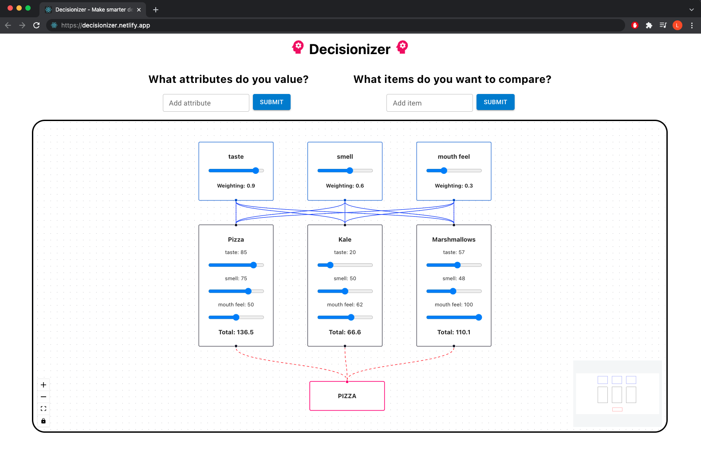

# Decision Making Helper

This is the GitHub repo for an app that helps you make decisions.

## Links

#### [UI Overview](https://whimsical.com/ui-decision-making-helper-CgGRuSAAHJFHFLqvoUZ5rp)

#### [Technical architecture](https://whimsical.com/states-objects-decision-making-helper-58dy1nJusBt9NprdBjNeeR)

#### [Deployed site](https://decisionizer.netlify.app/)

## App instructions

1. First, submit various attributes that you value in the items you will be comparing
2. Then, submit various items to compare
3. In any order, adjust* the weighting of the attributes and adjust how these items rank for each of these attributes *(to use the slider you have to click at certain positions, or click into it and use arrow keys)
4. Finally, click the 'Reveal winner!' button to complete the flowchart and show the winning item (i.e. the item with the largest sum of its weighted attributes)

## Process

First, I started getting everything initially setup: initialising create react-app with TypeScript, setting up CI/CD workflows on GitHub, and deploying to Netlify.

I began to work on a general app architecture / a states & objects overview, so that I could have a reference right from the start on _what_ data I needed to be capturing (from user input) and _where_ I should be passing it. This ultimately had to be iterated on as I coded up the app, but was still a useful reference (especially for the shape of my objects in order to keep TypeScript happy).

Luckily there was already a suggested UI, but I still built out a UI diagram to deal with the issue of user input. I originally wanted attributes and item-attribute rankings to be input only once upon submission (as a modal) because I wanted to reduce bias / slider-fiddling once the user sees the results, but then realised it would be a lot cleaner to keep those inputs within react flow.

### Notes on useReducer

I found useReducer a difficult concept to grasp - having to look far and wide for (understandable) implementations of it beyond a simple counter app.

As such, I decided to prioritise getting functionality down first, writing the code with useState, and plan to refactor to useReducer afterwards. Unfortunately I didn't have lots of time left so was only able to change some of my useStates to useReducer. Perhaps also writing initially with useStates made my code harder to refactor than it would have been to manage the states with useReducer from scratch.

However, I also felt that because my states were mainly objects (as opposed to multiple states for each key: value pair) it didn't feel overly messy.

### Notes on React Flow

I decided to first create some dummy data, and then use it to fill out a (hard-coded) React Flow diagram. Whilst a bit slow, this helped me in a few ways:

1.  I got to grips quickly with the general functionality of the React Flow library
2.  It become clear in what shape I need my data - i.e. what should an attribute object look like
3.  I was able to abstract away from having to worry about state (and useReducer!), or having to pass around real data for the time being

## Limitations / Bugs

Here's a few issues I'm aware of but didn't want to go too over time to fix:

- The slider inputs can not be changed via clicking and dragging the cursor (but can be clicked around / use arrow keys). It's currently inside an already draggable react flow node which is causing this issue. Potential fix idea would be to make the react flow nodes undraggable when this input is being clicked/focused on.
- The winning node created by the 'Reveal winner!' button does not replace the original node, instead it just creates a new one in exactly the same position. A fix would be to have the clicking of the reveal button delete the original node from the elements list (and also match up the new edges accordingly)
- Locally, but not on my deployed site, I am getting this warning to the console `Cannot update a component (MainContent) while rendering a different component (AttributeNode). To locate the bad setState() call inside AttributeNode, follow the stack trace as described in https://reactjs.org/link/setstate-in-render` - not sure on this one!

## Further implementations

If I had more time, other than fixing the above, I would like to prioritise the following:

- The node positions aren't properly responsive - the app currently looks best with around 3 attributes and 3 items
- The item scores should be revealed in a similar way to the winning node. I don’t want to introduce bias (e.g. ‘Oh I actually prefer this, I’ll just adjust this attribute until it becomes the favourite)
